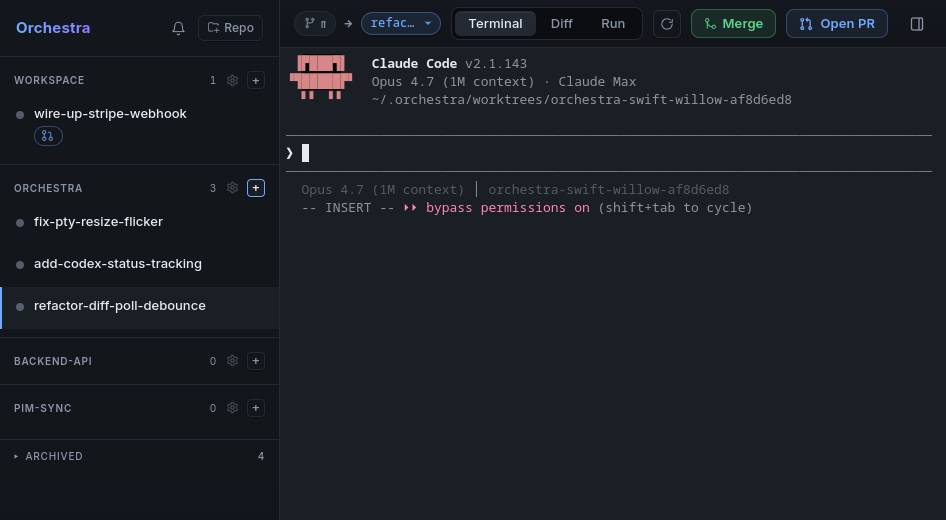

# Orchestra

> **A Conductor-like app for Linux: run parallel Claude Code agents in isolated git worktrees — and let agents spawn agents.**

If you've seen [Conductor](https://conductor.build) on macOS, Orchestra is that idea for Linux (it runs on macOS and Windows too, built from source). Each agent gets its own branch in its own git worktree, and you watch them all from one dashboard: live terminal, cumulative diff, one-click PR.

[](LICENSE)




## What makes Orchestra different

**Agents can spawn other agents.** Every Orchestra agent is told, at session start, that it can delegate independent work to a brand-new worktree with its own autonomous agent — one `curl` to Orchestra's local socket and the new workspace appears in the dashboard, branch cut from base, agent already working. Spawned agents get the same capability, so a worktree agent can spawn worktree agents that spawn worktree agents. Ask one agent to parallelize a refactor and watch the sidebar fill up.

Everything else you'd expect is there:

- **Isolated worktrees** — each workspace is a real `git worktree` (own directory, own `HEAD`, shared `.git`); agents never clobber each other
- **Live terminals** — real TTY per agent, full color, resize, scrollback
- **Diff-first review** — side-by-side Monaco diff per workspace, refreshing while the agent works
- **One-click PR** — commit → push → `gh pr create` from the dashboard
- **Hook-based status** — running/waiting flips off Claude Code's own hooks, no polling or terminal scraping
- **Self-naming branches** — the agent renames its branch once it understands the task
- **Per-repo setup scripts** and **one-step archive** (worktree + branch removed together)

## Install

### Linux (AppImage)

Download the latest `Orchestra.AppImage` from the [releases page](https://github.com/lcsmas/orchestra/releases), then:

```bash
chmod +x Orchestra.AppImage
./Orchestra.AppImage
```

> **Note:** Requires FUSE. Without it, run with `--appimage-extract-and-run`.

ARM64/Asahi: no pre-built AppImage yet — [build from source](#build-from-source) for a native build.

### macOS / Windows

No pre-built binaries yet — [build from source](#build-from-source). Contributions to the release pipeline welcome.

## Build from source

Requires Node 20+, plus the [`claude`](https://docs.anthropic.com/claude-code) CLI and [`gh`](https://cli.github.com/) on `PATH`. On Linux you'll also need build tools for the `node-pty` native module (`build-essential` on Debian/Ubuntu, `gcc-c++ make` on Fedora).

```bash
git clone https://github.com/lcsmas/orchestra.git
cd orchestra
npm install
npx electron-rebuild   # rebuild node-pty for Electron's node ABI
npm run dev            # vite + electron, hot reload
```

`npm run build` produces a distributable in `release/`.

## How it works

- **Worktrees** — each workspace lives at `~/.orchestra/worktrees/<repo>-<branch>-<uid>/`, created with `git worktree add` off the configured base branch. Archiving removes the worktree and deletes the branch.
- **Agents** — spawned via `node-pty` in the worktree, wired to an xterm.js terminal in the UI.
- **Hooks** — Orchestra installs Claude Code hooks into each worktree's `.claude/settings.local.json`. They talk to a Unix-socket HTTP server in the main process: activity status, agent-driven branch rename, and the `/spawn` endpoint that lets any agent create a new workspace + agent. All hooks are env-guarded, so running `claude` outside Orchestra is a silent no-op.
- **PRs** — `commit → push -u origin <branch> → gh pr create --base <baseBranch>`.

## CLI

Orchestra ships a standalone `orchestra` command (a small Node program, no Electron) that talks to a running app over its Unix socket. It's installed alongside the app via the package `bin`.

```bash
orchestra peers                                       # list the other agent workspaces (id, branch, repo, status)
orchestra read <id> [--lines N]                       # print a workspace's transcript (default 80 lines)
orchestra message <id> <text...>                      # send a prompt to a workspace
orchestra spawn --task <text> [--repo <path>] [--base <branch>]   # spawn a new worktree + agent
orchestra rename <id> <branch>                         # rename a workspace's branch
orchestra add-repo <path>                              # register a repo (path is resolved to absolute)
orchestra delete <id> --yes                            # delete a workspace (removes its worktree + branch)
orchestra --help                                      # usage for all commands
```

Every response is JSON of shape `{ ok: true, ... }` or `{ ok: false, error }`. On `ok: false` or a non-2xx status the CLI prints the error to stderr and exits 1; on success it exits 0.

**Socket discovery** — the CLI finds the app's socket in this order:

1. the `ORCHESTRA_SOCK` environment variable, if set;
2. else the contents of the well-known pointer file `~/.orchestra/sock` (its body is the absolute socket path);
3. else it prints `Orchestra does not appear to be running (no socket found)` and exits 1.

## Storage

- Config + workspace list: `<userData>/orchestra/store.json`
- Worktrees: `~/.orchestra/worktrees/`
- Per-workspace setup logs: `<worktreePath>/.orchestra/setup.log`

## Contributing

Issues and PRs welcome. For non-trivial changes, please open an issue first to discuss the approach.

## License

Apache License 2.0 — see [LICENSE](LICENSE).
