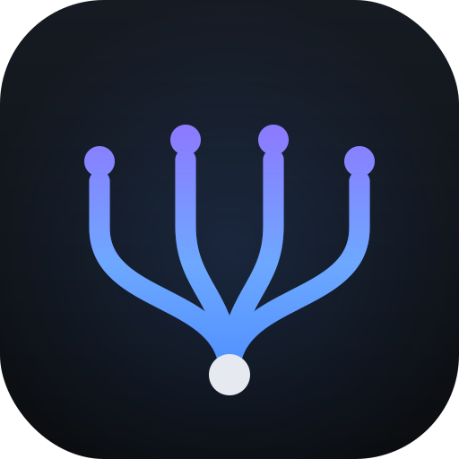

<p align="center">
  
</p>

# Orchestra

> **A Conductor-like app for Linux: run parallel Claude Code agents in isolated git worktrees — and let agents spawn agents.**

If you've seen [Conductor](https://conductor.build) on macOS, Orchestra is that idea for Linux (it runs on macOS and Windows too, built from source). Each agent gets its own branch in its own git worktree, and you watch them all from one dashboard: live terminal, cumulative diff, one-click PR.

[](LICENSE)


**New here?** The [user guide](docs/guide/README.md) walks through every feature and use case — and the same tour lives inside the app behind the **?** button in the sidebar.

## What makes Orchestra different

**Agents can spawn other agents.** Every Orchestra agent is told, at session start, that it can delegate independent work to a brand-new worktree with its own autonomous agent — one CLI call and the new workspace appears in the dashboard, branch cut from base, agent already working. Spawned agents get the same capability, so a worktree agent can spawn worktree agents that spawn worktree agents. Ask one agent to parallelize a refactor and watch the sidebar fill up.

**Orchestra can improve itself.** Register Orchestra's own repo as a spawn target and point an agent at it: the agent is told it is modifying the app that runs it, works in an isolated worktree like any other, and can release + install its own change. Your copy of Orchestra gets better because you asked it to. See [Self-improvement](docs/guide/self-improvement.md).

## Feature tour

### The core loop
- **Isolated worktrees** — each workspace is a real `git worktree` (own directory, own `HEAD`, shared `.git`); agents never clobber each other
- **Scratch sessions** — throwaway agents with no repo and no git, one click, zero setup
- **Orchestrators** — coordinator agents that delegate instead of coding; the children they spawn nest beneath them in the sidebar, and a guard hook blocks them from editing children's files
- **Self-naming branches** — the agent renames its branch once it understands the task
- **Per-repo setup / run / archive scripts** and **one-step archive** (worktree + branch removed together)
- **Resume on restart** — agents that were running when Orchestra quit come back live (`claude --continue`)

### Multi-agent orchestration
- **Spawn** — any agent creates a sibling workspace + agent with `orchestra spawn --task "…"`
- **Peer comms** — agents list siblings, read each other's transcripts, and message each other; messages to a stopped agent queue in an inbox delivered on its next start
- **Attach / detach** — re-parent any existing workspace under an orchestrator (or pop it back out)

### Review & ship
- **Diff-first review** — side-by-side Monaco diff per workspace, refreshing while the agent works; +/− counts on every sidebar row
- **One-click PR** — commit → push → `gh pr create` from the dashboard, with PR state tracked in the sidebar
- **Merge & release pills** — merged / diverged / unpushed detection per branch, plus the earliest release containing the branch's commits
- **Base sync** — behind/ahead counts vs. `origin/<base>`, refreshed on focus

### Terminals & status
- **Live terminals** — real TTY per agent, full color, resize, scrollback, image paste
- **Run terminal** — a second PTY per workspace running the repo's run script (dev server, tests) with Start/Stop
- **Nvim pane** — split the main pane with Neovim opened on the worktree
- **Hook-based status** — running / waiting / idle / error flips off Claude Code's own hooks, no polling or terminal scraping; plus a live context-size badge per agent
- **Chime** — a synthesized notification sound when an agent finishes while the window is unfocused (~20 to pick from)

### Accounts & usage
- **Multi-account** — add extra Claude logins; pin any workspace to any account, or migrate one mid-conversation and the session resumes under the new login
- **Usage bars** — 5-hour and weekly utilization per account at the bottom of the sidebar
- **Prompt queue** — prompts submitted over a usage limit park in a queue and auto-submit when the window resets

### Remote sandbox agents
- **Import to sandbox** — move a workspace into an always-on Docker container: agent, checkout, and session live remotely and keep working with the laptop closed
- **Eject** — bring it back to a local worktree at any time; automatic periodic backups while remote
- **Multi-machine** — open the same sandbox workspace from several machines; an ownership lock makes one the driver, the rest read-only viewers

### Integrations & extras
- **Linear** — branches named `TEAM-123-…` get a live Linear issue badge in the sidebar
- **Insights & Improvements** — a monthly self-tune pass regenerates each login's Claude Code insights report and distills new lessons into `~/.claude/LESSONS.md`
- **In-app help** — the **?** button opens a feature guide; the welcome screen highlights the essentials

## Install

### Linux (AppImage)

Download the latest `Orchestra.AppImage` from the [releases page](https://github.com/lcsmas/orchestra/releases), then:

```bash
chmod +x Orchestra.AppImage
./Orchestra.AppImage
```

> **Note:** Requires FUSE. Without it, run with `--appimage-extract-and-run`.

ARM64/Asahi: no pre-built AppImage yet — [build from source](#build-from-source) for a native build.

### macOS / Windows

No pre-built binaries yet — [build from source](#build-from-source). Contributions to the release pipeline welcome.

## Build from source

Requires Node 20+ and [pnpm](https://pnpm.io/), plus the [`claude`](https://docs.anthropic.com/claude-code) CLI and [`gh`](https://cli.github.com/) on `PATH`. On Linux you'll also need build tools for the `node-pty` native module (`build-essential` on Debian/Ubuntu, `gcc-c++ make` on Fedora).

```bash
git clone https://github.com/lcsmas/orchestra.git
cd orchestra
pnpm install
pnpm exec electron-rebuild   # rebuild node-pty for Electron's node ABI
pnpm run dev                 # vite + electron, hot reload
```

`pnpm run build` produces a distributable in `release/`.

## How it works

- **Worktrees** — each workspace lives at `~/.orchestra/worktrees/<repo>-<branch>-<uid>/`, created with `git worktree add` off the configured base branch. Archiving removes the worktree and deletes the branch.
- **Agents** — spawned via `node-pty` in the worktree, wired to an xterm.js terminal in the UI.
- **Hooks** — Orchestra installs Claude Code hooks into each worktree's `.claude/settings.local.json`. They talk to a Unix-socket HTTP server in the main process: activity status, agent-driven branch rename, and the `/spawn` endpoint that lets any agent create a new workspace + agent. All hooks are env-guarded, so running `claude` outside Orchestra is a silent no-op.
- **Capability skills** — each worktree also gets a set of `orchestra-*` Claude Code skills (spawn, comms, rename, promote, attach, repos, migrate-account), so agents discover their powers on demand instead of carrying them in every prompt.
- **PRs** — `commit → push -u origin <branch> → gh pr create --base <baseBranch>`.

## CLI

Orchestra ships an `orchestra` command that talks to a running app over its local socket. The CLI is bundled inside the app itself — the same binary doubles as the CLI when invoked as `<app> cli …` — so there's no separate install:

- **Linux (AppImage):** on first GUI launch the app writes a shim to `~/.local/bin/orchestra` (on most distros already on `PATH`) that re-invokes the AppImage in CLI mode. After launching the app once, just run `orchestra …`.
- **Windows:** the app writes `orchestra.cmd` to `%LOCALAPPDATA%\Orchestra\bin`; add that dir to `PATH` (the installer can do this) and run `orchestra …`.
- **Any platform / dev:** you can always invoke it directly — `<App> cli peers`, or in dev `node dist-electron/cli.js peers`.

```bash
orchestra peers                                       # list the other agent workspaces (id, branch, repo, status)
orchestra read <id> [--lines N]                       # print a workspace's transcript (default 80 lines)
orchestra message <id> <text...>                      # send a prompt to a workspace
orchestra spawn --task <text> [--repo <path>] [--base <branch>] [--detached]   # spawn a new worktree + agent
orchestra rename <id> <branch>                         # rename a workspace's branch
orchestra promote <id>                                 # promote a scratch session into an orchestrator
orchestra attach <id> <parentId>                       # nest an existing workspace under an orchestrator
orchestra detach <id>                                  # pop a workspace back out to its own section
orchestra add-repo <path>                              # register a repo (path is resolved to absolute)
orchestra delete <id> --yes                            # delete a workspace (removes its worktree + branch)
orchestra accounts                                     # list configured Claude accounts (id + label)
orchestra migrate-account <id> <accountId>             # migrate a workspace to another account (--default to go back)
orchestra --help                                      # usage for all commands
```

Every response is JSON of shape `{ ok: true, ... }` or `{ ok: false, error }`. On `ok: false` or a non-2xx status the CLI prints the error to stderr and exits 1; on success it exits 0.

**Socket discovery** — the CLI finds the app's socket in this order:

1. the `ORCHESTRA_SOCK` environment variable, if set;
2. else the contents of the well-known pointer file `~/.orchestra/sock` (its body is the absolute socket path);
3. else it prints `Orchestra does not appear to be running (no socket found)` and exits 1.

## Storage

- Config + workspace list: `<userData>/orchestra/store.json`
- Worktrees: `~/.orchestra/worktrees/`
- Per-workspace setup logs: `<worktreePath>/.orchestra/setup.log`

## Documentation

- **[User guide](docs/guide/README.md)** — every feature and use case, from first workspace to self-improvement
- **[Codebase map](docs/codebase-map/)** — per-subsystem architecture reference with `file:line` anchors, for contributors and for agents working on Orchestra itself

## Contributing

Issues and PRs welcome. For non-trivial changes, please open an issue first to discuss the approach.

## License

Apache License 2.0 — see [LICENSE](LICENSE).
