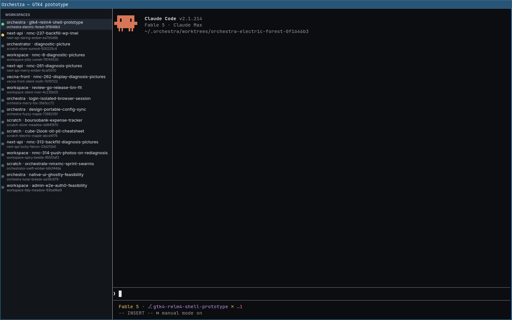
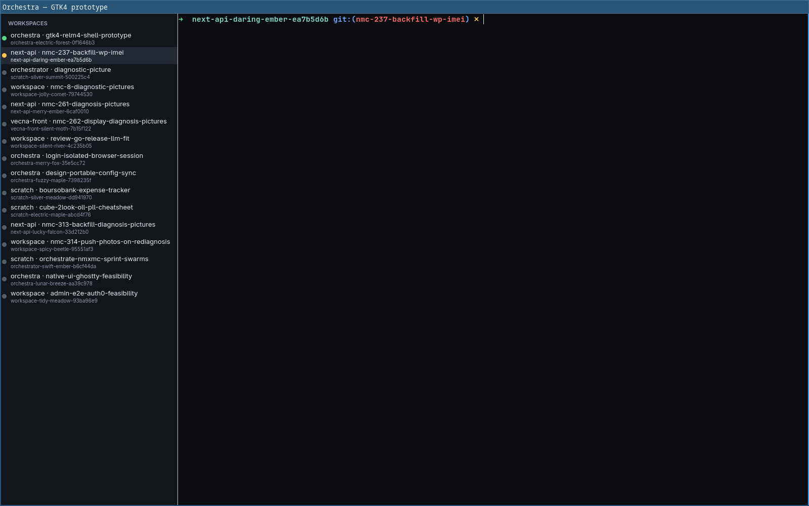

# GTK4 + Relm4 + VTE prototype of Orchestra's shell — findings

*Exploratory draft, 2026-07-18, on Asahi Fedora 42 aarch64 (GTK 4.18.6, VTE 0.80.5,
rustc 1.95, relm4 0.11, gtk4-rs 0.11.4, vte4 0.10). Companion to
`docs/native-ui-exploration.md`, which designated GTK4+Relm4 as the long-term
native target. This makes it concrete: a window with the workspace sidebar
(live `store.json` data, colored status dots), a VTE terminal per workspace
spawned in its real worktree, switchable from the sidebar (stretch goal:
done), styled to approximate Orchestra's dark theme. ~300 lines of Rust.*




## Build & run

System deps: `rustc`/`cargo` (present), `gtk4-devel`, `vte291-gtk4-devel` (+
their pkg-config chains). **Neither devel package was installed and sudo is
unavailable** — worked around it rootlessly, which is worth knowing about:

```bash
cd prototypes/gtk4-shell
./setup-localdeps.sh     # dnf download (no root) + rpm2cpio-extract 11 RPMs
                         # into .localdeps/prefix, strip Requires.private from
                         # the .pc files, repoint dangling dev .so symlinks at
                         # the system runtime libs
source env.sh            # PKG_CONFIG_PATH + RUSTFLAGS -L + LD_LIBRARY_PATH
cargo build --release
./target/release/orchestra-gtk4-shell
```

Why this works: the Rust `-sys` crates never compile C — they only need `.pc`
files for link flags and a linkable `libfoo.so`. The gtk4 *runtime* was already
installed; only `vte291-gtk4` needed its runtime lib extracted too (hence the
`LD_LIBRARY_PATH` line). On a machine with sudo, `dnf install gtk4-devel
vte291-gtk4-devel` replaces all of this.

Knobs: `ORCHESTRA_STORE=<path>` (defaults to
`~/.config/orchestra/orchestra/store.json`, falls back to fixtures),
`ORCH_GTK_CMD=<cmd>` (terminal child, defaults to `$SHELL`),
`ORCH_GTK_AUTOCYCLE=<n>` (headless-test hook: auto-switch to row n at t+3s and
back at t+6s). On this machine GUI windows must run inside a second headless
sway (`WLR_BACKENDS=headless`, see `.claude/skills/verify`); screenshots via
`grim` on that socket.

## What was actually exercised

- **Claude Code v2.1.214 full TUI** inside the VTE pane, spawned in this very
  worktree: truecolor logo, status line, spinner, INSERT-mode footer all
  correct (screenshot above). VTE sets `TERM=xterm-256color` +
  `COLORTERM=truecolor` itself, and Claude renders truecolor without any of
  the TERM_PROGRAM-allowlist negotiation pain we debugged in xterm.js.
- **Throughput**: 200k lines (~14 MB) of `seq` output through the PTY with
  live rendering in **0.74 s ≈ 19 MB/s** (VTE 0.80's GSK GPU renderer,
  backpressure-bound — this is the terminal's real consumption speed). No
  freeze, no garbling. For contrast, this workload class is exactly why
  Orchestra grew `term-write-queue.ts` (RAF batching) and the WebGL addon.
  *Not* a head-to-head number — I didn't run the same bench in xterm.js — but
  it clears the bar comfortably.
- **Real store.json**: 17 live workspaces listed with correct status dots
  (green running / yellow waiting / dim idle), running-first sort. The data
  even drifted between runs as sibling agents changed status — it's genuinely
  live data, re-read at launch.
- **Switchable terminals** (stretch goal): lazily-created VTE per workspace in
  a `GtkStack`; switching to a second workspace spawns zsh in *its* worktree
  (branch prompt confirms), switching back shows the first terminal with
  scrollback/state intact.
- **Not measured, honestly**: input latency and scroll *feel* — the core
  subjective complaint driving the native exploration. Headless sway's seat
  has no pointer/keyboard device, so I could not type into the terminal or
  scroll it interactively. The throughput and rendering-correctness evidence
  is real; the "does it feel like Ghostty" question still needs a human on a
  visible display (`cargo run` + click around — 30 seconds of the owner's
  time).

## VTE vs xterm.js, from the embedding side

The striking part is what I *didn't* have to build: `spawn_async` gives you
PTY allocation, child spawn in a cwd, env merging (empty `envv` = inherit +
VTE's TERM/COLORTERM), resize handling, and GPU-accelerated rendering in one
call. The xterm.js equivalent in Orchestra is node-pty + the transport layer +
fit/webgl/unicode11 addons + the write queue + SIGWINCH-healing. The whole
terminal side of this prototype is ~40 lines including the color palette.

Costs on the other side of the ledger: VTE's API is coarser (no
`onData`-style interception in the same way — Orchestra's PTY-log spooling and
activity detection would have to move fully server-side, which the transport
abstraction already supports), scrollback is VTE-owned, and theming is
programmatic (`set_colors`) rather than CSS.

## Relm4 coming from React/Zustand

- The `view!` macro is JSX-shaped and pleasant for **static** structure; the
  sidebar+paned+stack skeleton reads like a component. `Msg` enums +
  `update()` map naturally onto reducer thinking. Watchers/trackers exist for
  fine-grained reactivity (not needed here).
- The moment structure is **dynamic** (a terminal widget per workspace,
  created on demand) you drop out of the macro into imperative gtk-rs and
  stash widget handles in the model (`self.stack.add_named(...)`). That
  escape hatch is fine — GTK widgets are refcounted handles, mutation is the
  model — but it's a mindset flip from "state → render". A live-updating
  sidebar would use Relm4's factory system, which I skipped for this static
  snapshot.
- Macro compile errors are the roughest edge: my wrong stack-page syntax
  (`} -> {`) produced "expected `,`" deep in expansion, fixed by knowing the
  `add_named[Some("empty")] = &gtk::Label {...}` form. TS/React error quality
  is better. Incremental rebuilds were 0.8 s, so error-driven iteration is
  fast once deps are compiled (first build: a few minutes, 57 crates).
- GTK CSS is real CSS (the Orchestra palette dropped in almost verbatim) but
  theme specificity bites: `listbox row:selected` lost to the Adwaita theme's
  selection color until widened to `list row:selected`.

Footprint: 1.2 MB binary; **~88 MB RSS** with two live terminals (single
process), vs the multi-process Electron baseline several times that.

## Sharpest obstacles actually hit

1. **Missing devel packages, no sudo** — solved rootlessly (see Build), but
   `pkg-config` insisting on resolving `Requires.private` chains (~20 extra
   devel packages we don't need) required stripping those lines from the
   extracted `.pc` files. This is a CI/dev-env consideration for any real
   port, not a code problem.
2. **No E2E story out of the box** — the confirmation of the feasibility
   study's warning. Synthetic compositor clicks (`swaymsg seat cursor press`)
   never reach the client because the headless seat advertises no pointer
   capability; there is no CDP equivalent to drive a GTK app. I resorted to a
   baked-in `ORCH_GTK_AUTOCYCLE` hook. A real port needs a deliberate answer:
   AT-SPI/accessibility automation, a debug IPC surface, or virtual input
   devices (`wlrctl`/virtual-pointer protocol — not installed here). This is
   the single biggest cultural loss vs the current CDP verify harness.
3. **Relm4 macro syntax friction** — minor but real; see above.

## Revised effort estimate for a full port

The feasibility study said "months, full UI rewrite". After building this, I'd
refine rather than revise:

- **Terminal-first shell** (sidebar with live status over the existing
  hooks/socket, spawn/kill, N switchable terminals, dark theme): **2–4
  weeks**, not months. The widget layer is genuinely easy; this half-day
  prototype covers maybe a third of that surface, and VTE removes the whole
  category of terminal-renderer engineering Orchestra currently maintains.
- The sane architecture is **GTK frontend + existing Node main process as a
  headless daemon** over the already-promise-shaped 83-channel surface
  (JSON-RPC on the local socket). Rewriting `workspaces.ts`/`git.ts` (170K+)
  in Rust would alone eat the months — don't.
- **Feature parity minus the two known hard losses** (Monaco→GtkSourceView
  diff viewer, dashboards/charts, dialogs, settings): **~2–3 months** of
  focused work, matching the study.
- The hard tail is unchanged and now partly *confirmed by experience*:
  per-account OAuth (needs WebKitGTK embedding), and the E2E harness
  (obstacle 2 above — real, hit it within the first hour).

**Verdict:** the GTK4+Relm4+VTE stack is nicer to work in than expected, the
terminal widget is a solved problem (and the libghostty-gtk4 widget, when it
ships, would slot into the same pane), and the shell chrome is cheap. What
makes a full port expensive is exactly what the study said: the diff viewer,
the dashboards, OAuth, and the verification culture — none of which this
prototype touched. As a *terminal host*, native GTK is ready today; the tmux
session broker remains the right next production step, with this prototype as
the proof that the eventual destination is comfortable.
